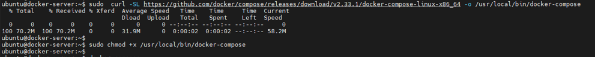
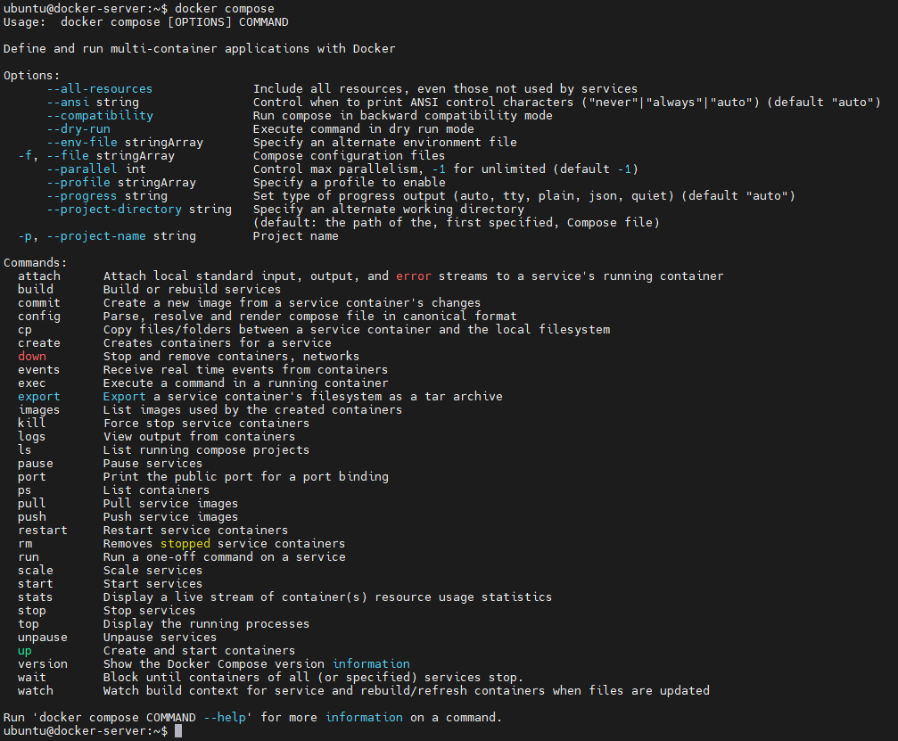

### Etapa Única: Preparar e instalar o docker compose
````
sudo  curl -SL https://github.com/docker/compose/releases/download/v2.33.1/docker-compose-linux-x86_64 -o /usr/local/bin/docker-compose
sudo chmod +x /usr/local/bin/docker-compose
````


#### Docker Compose 
````
docker compose
````
