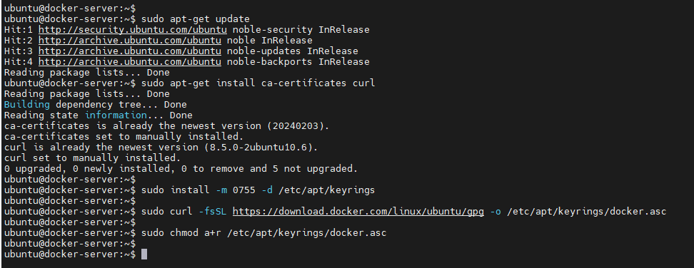

### Etapa 1: Remover alguma versão que esteja instalado ###

````
sudo apt autoremove docker.io
````


### Etapa 2: Preparação para instalar o docker engine ###

````
sudo apt-get update
sudo apt-get install ca-certificates curl
sudo install -m 0755 -d /etc/apt/keyrings
sudo curl -fsSL https://download.docker.com/linux/ubuntu/gpg -o /etc/apt/keyrings/docker.asc
sudo chmod a+r /etc/apt/keyrings/docker.asc
````


### Etapa 3: Configuração do repositório ###

````
echo \
  "deb [arch=$(dpkg --print-architecture) signed-by=/etc/apt/keyrings/docker.asc] https://download.docker.com/linux/ubuntu \
  $(. /etc/os-release && echo "${UBUNTU_CODENAME:-$VERSION_CODENAME}") stable" | \
  sudo tee /etc/apt/sources.list.d/docker.list > /dev/null
````


### Etapa 4: Instalação do docker engine ##

````
sudo apt-get update
sudo apt-get install docker-ce docker-ce-cli containerd.io docker-buildx-plugin docker-compose-plugin
````

### Etapa Final: Verique a versão do docker engine ##

````
docker --version
````
